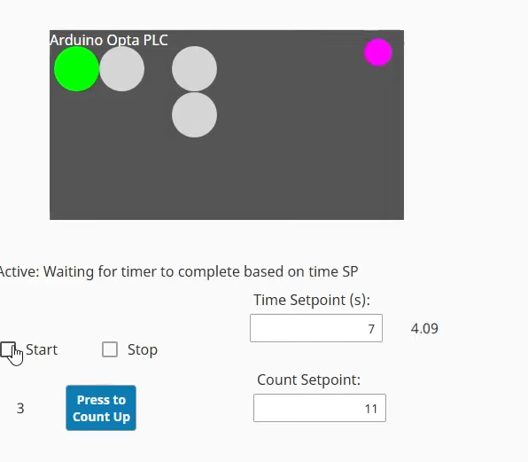
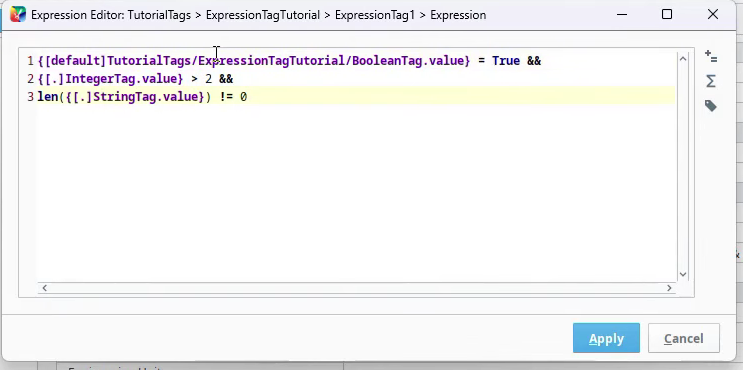
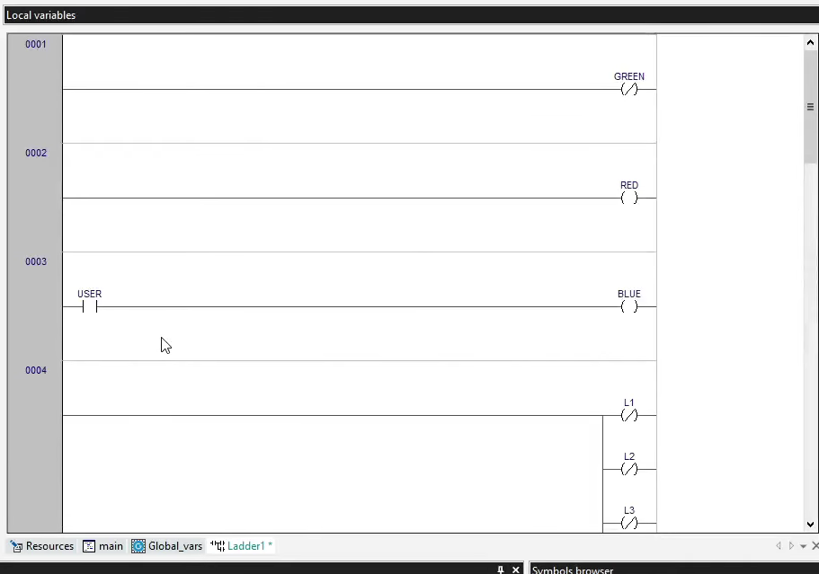
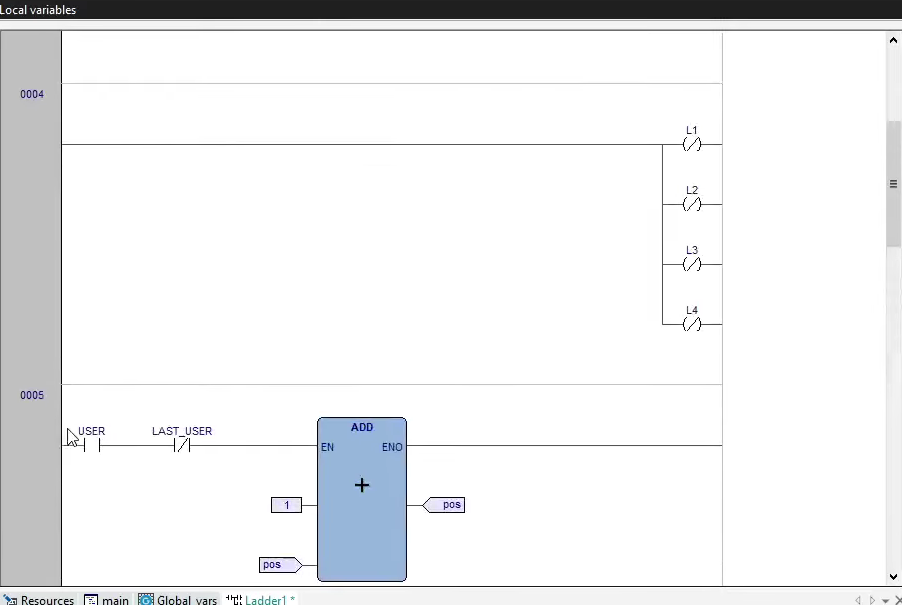
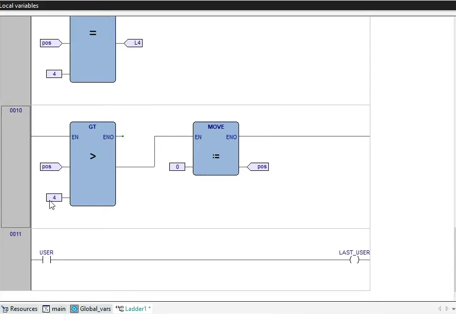
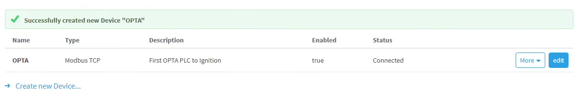
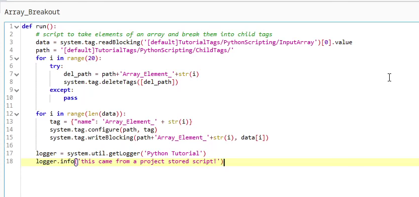
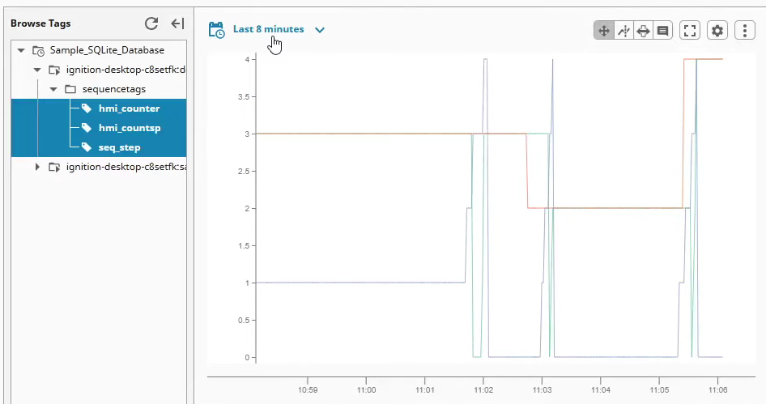
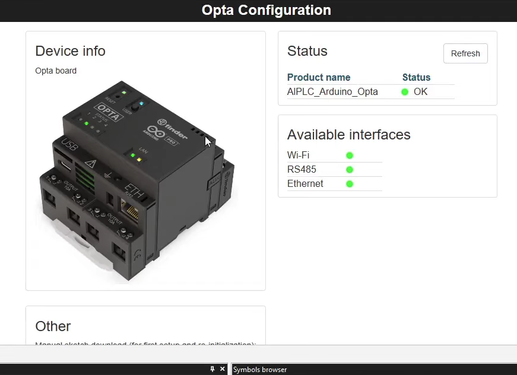

# PLC–HMI–SCADA Automation Project

Developed a complete PLC–HMI–SCADA system demonstrating sequential control, operator interaction, data logging, and scripting-based tag management.

**Platform:** Arduino Opta PLC, Ignition SCADA  
**Protocol:** Modbus TCP/IP  
**Database:** SQLite (Tag Historian)  

---

## Overview
This project demonstrates:

- Sequential control logic using timers and counters  
- Real-time HMI with status indicators, Start/Stop controls, and setpoints  
- PLC–SCADA communication via Modbus TCP  
- Tag History enabled with trend visualization  
- Python scripting to break PLC arrays into individual SCADA tags  
- Expression tags for logical validation and interlocks  

---

## Technical Highlights

- PLC programming on Arduino Opta  
- Ignition HMI design and animation  
- Python scripting for dynamic tag creation  
- SQL historian for process data logging  
- Relative tag paths and expression logic  

---

## Screenshots

### HMI Screens
  
  

### PLC Diagrams
  
  
  

### Connections
  

### Python Scripting
  

### Trends & Historian
  

### Hardware
  
